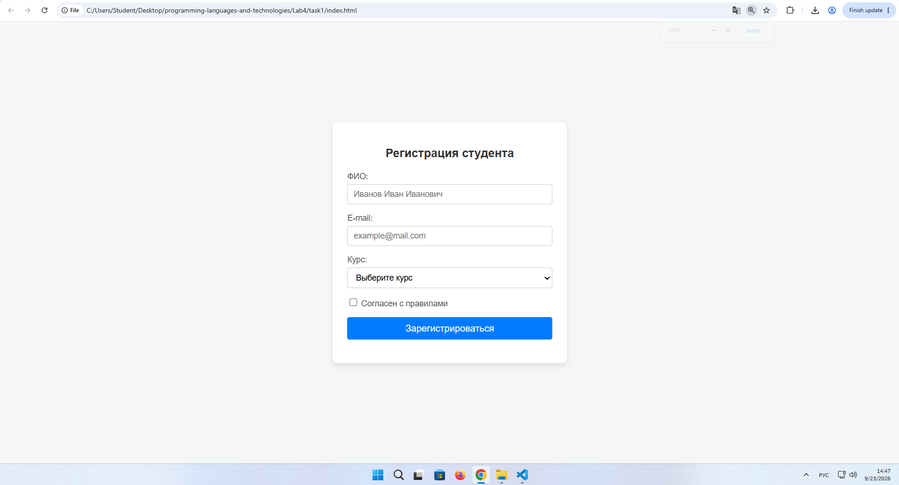
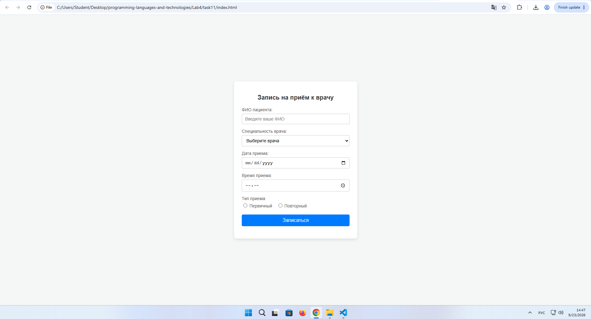
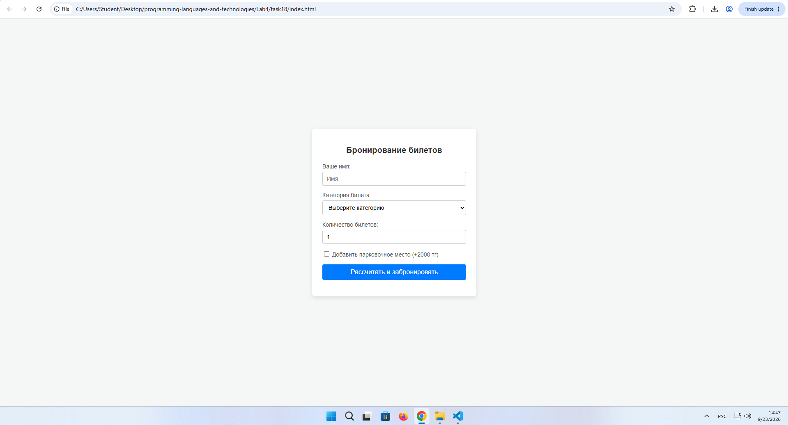

# Отчет по лабораторной работе №4
**Дисциплина:** Языки и технология программирования  
**Тема:** Формы и валидация на стороне клиента (HTML + JavaScript)

## 1. Цель работы
Освоить создание HTML-форм и базовую клиентскую валидацию с использованием JavaScript. Научиться применять текстовые поля, checkbox, radio, select, обрабатывать событие отправки формы, проверять обязательность и корректность введённых данных и выводить понятные сообщения пользователю.

---

## 2. Выполнение заданий

### Вариант №1: Форма регистрации студента
* **Условие:** ФИО, e-mail, курс (select), согласие с правилами (checkbox). Проверить заполнение всех обязательных полей.

#### Исходный код (Вариант 1)
**`index.html`**
```html
<!DOCTYPE html>
<html lang="ru">
<head>
    <meta charset="UTF-8">
    <title>Регистрация студента</title>
    <link rel="stylesheet" href="style.css">
</head>
<body>
    <div class="form-container">
        <h2>Регистрация студента</h2>
        <form id="studentForm">
            <div class="field">
                <label for="fullname">ФИО:</label>
                <input type="text" id="fullname" placeholder="Иванов Иван Иванович">
            </div>
            <div class="field">
                <label for="email">E-mail:</label>
                <input type="email" id="email" placeholder="example@mail.com">
            </div>
            <div class="field">
                <label for="course">Курс:</label>
                <select id="course">
                    <option value="">Выберите курс</option>
                    <option value="1">1 курс</option>
                    <option value="2">2 курс</option>
                    <option value="3">3 курс</option>
                    <option value="4">4 курс</option>
                </select>
            </div>
            <div class="field checkbox-field">
                <label>
                    <input type="checkbox" id="agree"> Согласен с правилами
                </label>
            </div>
            <button type="submit">Зарегистрироваться</button>
            <p id="message" class="message"></p>
        </form>
    </div>
    <script src="script.js"></script>
</body>
</html>
```

**`script.js`**
```javascript
document.getElementById('studentForm').addEventListener('submit', function(event) {
    event.preventDefault();
    
    const fullname = document.getElementById('fullname').value.trim();
    const email = document.getElementById('email').value.trim();
    const course = document.getElementById('course').value;
    const agree = document.getElementById('agree').checked;
    const message = document.getElementById('message');
    
    if (fullname === '') {
        message.textContent = 'Ошибка: Пожалуйста, введите ФИО.';
        message.className = 'message error';
        return;
    }
    if (email === '') {
        message.textContent = 'Ошибка: Пожалуйста, введите e-mail.';
        message.className = 'message error';
        return;
    }
    if (course === '') {
        message.textContent = 'Ошибка: Выберите курс обучения.';
        message.className = 'message error';
        return;
    }
    if (!agree) {
        message.textContent = 'Ошибка: Необходимо согласиться с правилами.';
        message.className = 'message error';
        return;
    }
    
    message.textContent = 'Успех! Регистрация студента прошла успешно.';
    message.className = 'message success';
});
```

#### Скриншот формы (Вариант 1):


---

### Вариант №11: Форма записи к врачу
* **Условие:** ФИО, специальность врача, дата, время, первичный/повторный прием (radio). Проверить обязательные поля.

#### Исходный код (Вариант 11)
**`index.html`**
```html
<!DOCTYPE html>
<html lang="ru">
<head>
    <meta charset="UTF-8">
    <title>Запись к врачу</title>
    <link rel="stylesheet" href="style.css">
</head>
<body>
    <div class="form-container">
        <h2>Запись на приём к врачу</h2>
        <form id="doctorForm">
            <div class="field">
                <label for="doctorName">ФИО пациента:</label>
                <input type="text" id="doctorName" placeholder="Введите ваше ФИО">
            </div>
            <div class="field">
                <label for="specialty">Специальность врача:</label>
                <select id="specialty">
                    <option value="">Выберите врача</option>
                    <option value="терапевт">Терапевт</option>
                    <option value="хирург">Хирург</option>
                    <option value="кардиолог">Кардиолог</option>
                    <option value="невролог">Невролог</option>
                </select>
            </div>
            <div class="field">
                <label for="appDate">Дата приема:</label>
                <input type="date" id="appDate">
            </div>
            <div class="field">
                <label for="appTime">Время приема:</label>
                <input type="time" id="appTime">
            </div>
            <div class="field">
                <label>Тип приема:</label>
                <div class="radio-group">
                    <label><input type="radio" name="visitType" value="первичный"> Первичный</label>
                    <label><input type="radio" name="visitType" value="повторный"> Повторный</label>
                </div>
            </div>
            <button type="submit">Записаться</button>
            <p id="message" class="message"></p>
        </form>
    </div>
    <script src="script.js"></script>
</body>
</html>
```

**`script.js`**
```javascript
document.getElementById('doctorForm').addEventListener('submit', function(event) {
    event.preventDefault();
    
    const name = document.getElementById('doctorName').value.trim();
    const specialty = document.getElementById('specialty').value;
    const date = document.getElementById('appDate').value;
    const time = document.getElementById('appTime').value;
    const visitType = document.querySelector('input[name="visitType"]:checked');
    const message = document.getElementById('message');
    
    if (name === '') {
        message.textContent = 'Ошибка: Укажите ФИО пациента.';
        message.className = 'message error';
        return;
    }
    if (specialty === '') {
        message.textContent = 'Ошибка: Выберите специальность врача.';
        message.className = 'message error';
        return;
    }
    if (date === '') {
        message.textContent = 'Ошибка: Выберите дату приема.';
        message.className = 'message error';
        return;
    }
    if (time === '') {
        message.textContent = 'Ошибка: Выберите время приема.';
        message.className = 'message error';
        return;
    }
    if (!visitType) {
        message.textContent = 'Ошибка: Выберите тип приема (первичный или повторный).';
        message.className = 'message error';
        return;
    }
    
    message.textContent = `Успех! Вы записаны к врачу (${specialty}) на ${date} в ${time}.`;
    message.className = 'message success';
});
```

#### Скриншот формы (Вариант 11):




---

### Вариант №18: Форма бронирования мероприятия
* **Условие:** Данные пользователя, категория билета, количество, дополнительные опции. После валидации рассчитать итоговую стоимость.

#### Исходный код (Вариант 18)
**`index.html`**
```html
<!DOCTYPE html>
<html lang="ru">
<head>
    <meta charset="UTF-8">
    <title>Бронирование мероприятия</title>
    <link rel="stylesheet" href="style.css">
</head>
<body>
    <div class="form-container">
        <h2>Бронирование билетов</h2>
        <form id="eventForm">
            <div class="field">
                <label for="userName">Ваше имя:</label>
                <input type="text" id="userName" placeholder="Имя">
            </div>
            <div class="field">
                <label for="category">Категория билета:</label>
                <select id="category">
                    <option value="">Выберите категорию</option>
                    <option value="5000">Стандарт (5000 тг)</option>
                    <option value="10000">VIP (10000 тг)</option>
                    <option value="15000">Премиум (15000 тг)</option>
                </select>
            </div>
            <div class="field">
                <label for="amount">Количество билетов:</label>
                <input type="number" id="amount" min="1" max="10" value="1">
            </div>
            <div class="field checkbox-field">
                <label>
                    <input type="checkbox" id="parking" value="2000"> Добавить парковочное место (+2000 тг)
                </label>
            </div>
            <button type="submit">Рассчитать и забронировать</button>
            <p id="message" class="message"></p>
        </form>
    </div>
    <script src="script.js"></script>
</body>
</html>
```

**`script.js`**
```javascript
document.getElementById('eventForm').addEventListener('submit', function(event) {
    event.preventDefault();
    
    const userName = document.getElementById('userName').value.trim();
    const categorySelect = document.getElementById('category');
    const amountInput = document.getElementById('amount').value;
    const parkingChecked = document.getElementById('parking').checked;
    const message = document.getElementById('message');
    
    if (userName === '') {
        message.textContent = 'Ошибка: Пожалуйста, введите имя.';
        message.className = 'message error';
        return;
    }
    if (categorySelect.value === '') {
        message.textContent = 'Ошибка: Выберите категорию билета.';
        message.className = 'message error';
        return;
    }
    
    const amount = parseInt(amountInput);
    if (isNaN(amount) || amount <= 0) {
        message.textContent = 'Ошибка: Укажите корректное количество билетов (больше 0).';
        message.className = 'message error';
        return;
    }
    
    let ticketPrice = parseInt(categorySelect.value);
    let totalPrice = ticketPrice * amount;
    
    if (parkingChecked) {
        totalPrice += 2000;
    }
    
    message.innerHTML = `Успех, ${userName}! Бронирование оформлено.<br>Итоговая стоимость: <strong>${totalPrice} тенге</strong>.`;
    message.className = 'message success';
});
```

#### Скриншот формы (Вариант 18):


---

### Общие стили (`style.css`)
```css
body {
    font-family: Arial, sans-serif;
    background-color: #f4f7f6;
    display: flex;
    justify-content: center;
    align-items: center;
    height: 100vh;
    margin: 0;
}

.form-container {
    background: #ffffff;
    padding: 25px;
    border-radius: 8px;
    box-shadow: 0 4px 10px rgba(0, 0, 0, 0.1);
    width: 350px;
}

h2 {
    margin-bottom: 20px;
    font-size: 20px;
    color: #333;
    text-align: center;
}

.field {
    margin-bottom: 15px;
}

label {
    display: block;
    margin-bottom: 5px;
    font-size: 14px;
    color: #555;
}

input[type="text"],
input[type="email"],
input[type="date"],
input[type="time"],
input[type="number"],
select {
    width: 100%;
    padding: 8px 10px;
    box-sizing: border-box;
    border: 1px solid #ccc;
    border-radius: 4px;
    font-size: 14px;
}

.checkbox-field label,
.radio-group label {
    display: inline;
    font-weight: normal;
}

.radio-group {
    display: flex;
    gap: 15px;
    margin-top: 5px;
}

button {
    width: 100%;
    padding: 10px;
    background-color: #007bff;
    color: white;
    border: none;
    border-radius: 4px;
    font-size: 16px;
    cursor: pointer;
    transition: background-color 0.2s;
}

button:hover {
    background-color: #0056b3;
}

.message {
    margin-top: 15px;
    font-size: 14px;
    text-align: center;
}

.message.error {
    color: #d9534f;
}

.message.success {
    color: #28a745;
}
```

---

## 3. Тестирование (на примере Варианта №1)

| № | Входные данные | Ожидаемый результат | Фактический результат | Статус |
|---|---|---|---|---|
| 1 | Все поля пустые | Ошибка: «Введите ФИО» | Выведена ошибка по ФИО | Пройдено |
| 2 | Заполнено только ФИО | Ошибка: «Введите e-mail» | Выведена ошибка по e-mail | Пройдено |
| 3 | ФИО и e-mail есть, курс не выбран | Ошибка: «Выберите курс» | Выведена ошибка по курсу | Пройдено |
| 4 | Всё заполнено, checkbox не отмечен | Ошибка: «Подтвердите согласие» | Выведена ошибка по согласию | Пройдено |
| 5 | Все поля корректно заполнены и отмечены | Сообщение об успехе | Форма успешно прошла проверку | Пройдено |

---

## 4. Вывод
В ходе выполнения лабораторной работы были изучены принципы создания интерактивных HTML-форм и клиентской валидации с использованием языка JavaScript. Мы научились перехватывать событие отправки (`submit`), отменять стандартное поведение браузера (`event.preventDefault()`), работать со специфическими элементами ввода (`checkbox`, `radio`, `select`) и выводить динамические сообщения об ошибках или результатах расчетов без перезагрузки веб-страницы.